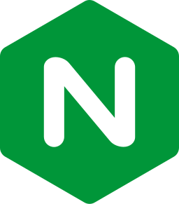
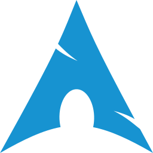

-   👋 Hi, I’m @hoanglinh371
-   👀 I’m interested in MERN Stack and Laravel
-   🌱 I’m currently learning Angular

---

### Tools:

 

---

### Languages:

 

---

### Libraries and Frameworks:

 

---

### Databases:

 

---

### Others:

 

---

### Contact:

